# ft_transcendence  BarcodePong

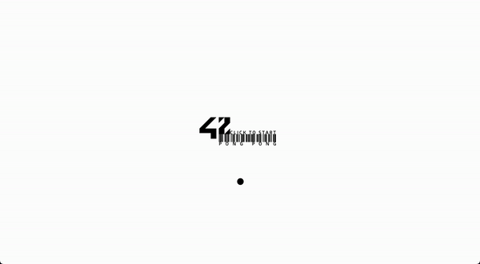

- Last and final 42 project on common course. This project is about creating a website for the Pong contest. Users will play Pong with others. You will enjoy real-time multiplayer online pong games with random match-making, chat room, direct message, changing profiles, 2FA Auth, managing friends list.
- Tech used on this project: **NestJS, NextJS, PostgreSQL**

##  Subject

[ft_transcendence subject PDF (EN, 2022)](https://github.com/keulee/ft_transcendence/blob/main/subject/ftTranscendence.en.subject.pdf)

##  Usage

(sudo) **make** : docker-compose up --build
 
**make fclean** : delete completely docker container, volume, network, image
 
**make re** : fclean all

##  url

**http://localhost:8000**

##  BarcodePong API document

You can check swagger API docs on http://localhost:8080/api once you successfully build the docker container

##  docker volume (postgresql)

You can check the mount point with command line 'docker volume inspect'

##  if you need to restart the front / back

(from the root where you find docker-compose.yml file)
 
For front : **docker restart front**
 
For back : **docker restart backend**

##  Screenshot of BarcodePong

##### First Page

##### Home Page
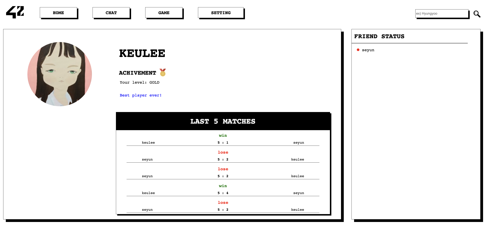

##### Chat Page
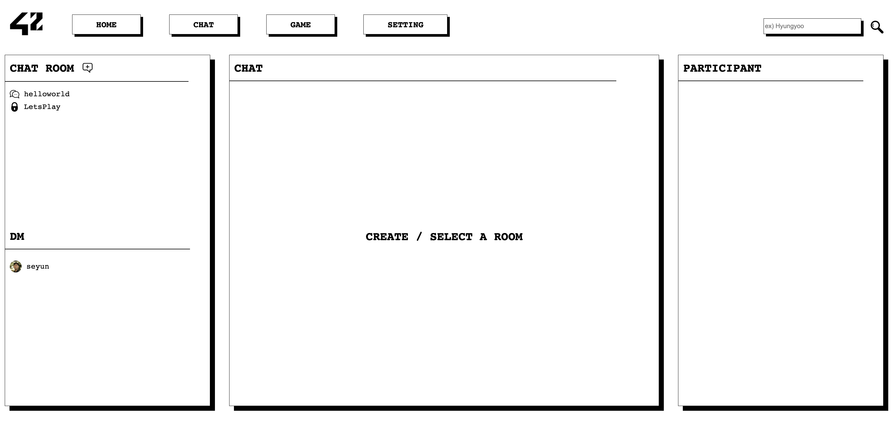

##### Create a Chat

##### Chat at Public room
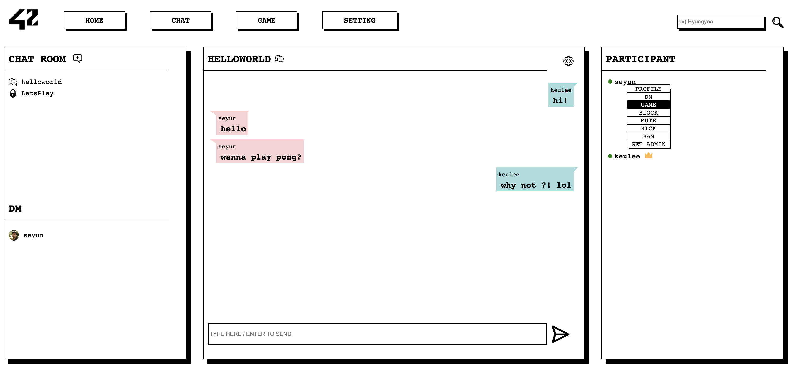

##### When you access to Private chat room
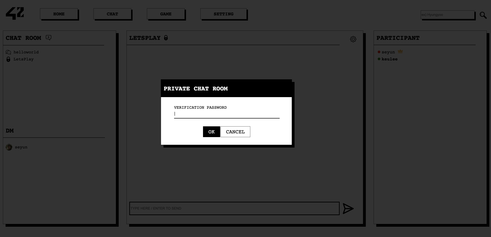

##### DM
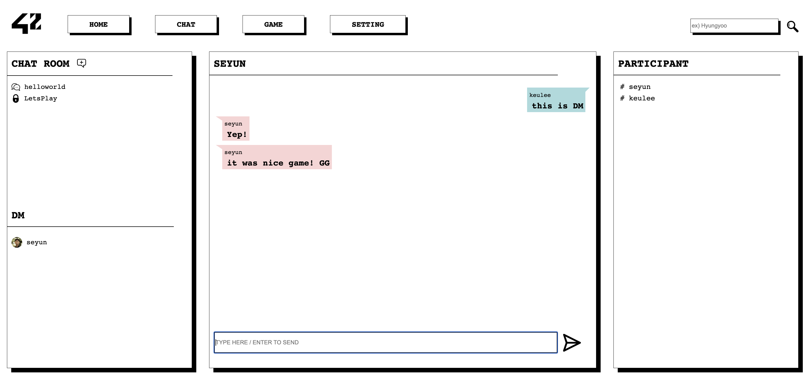

##### Game Page
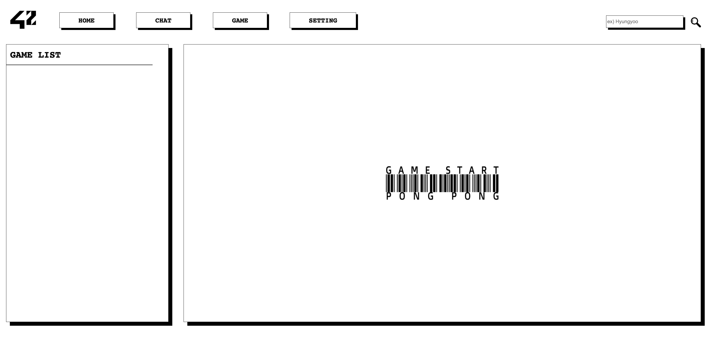

##### Loading for searching a random-matching game 
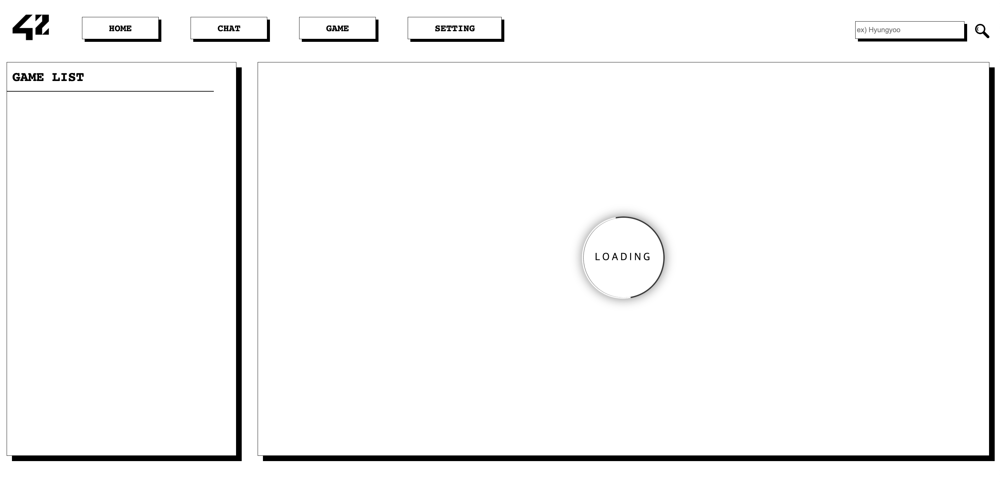

##### Game Setting 01 - For player who joined at the queue first (As Game room admin)
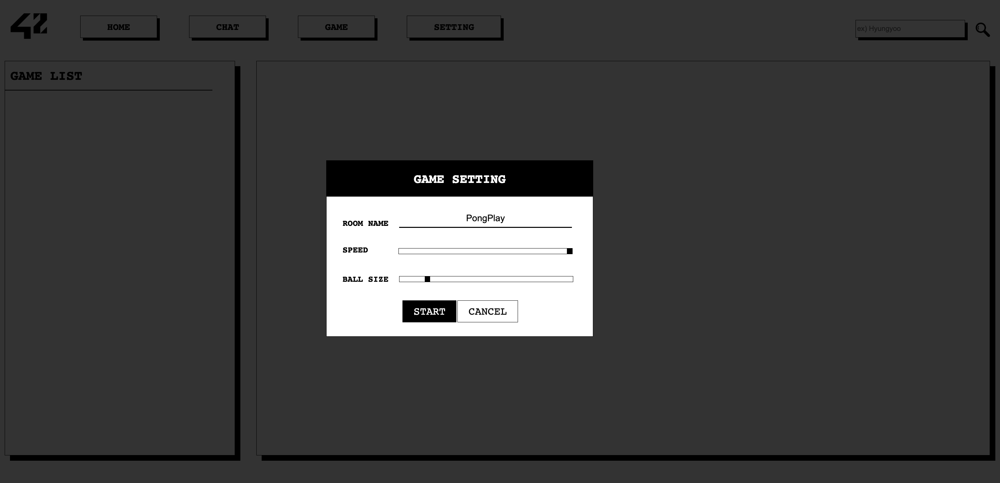

##### Game Setting 02 - For player who joined at the queue later
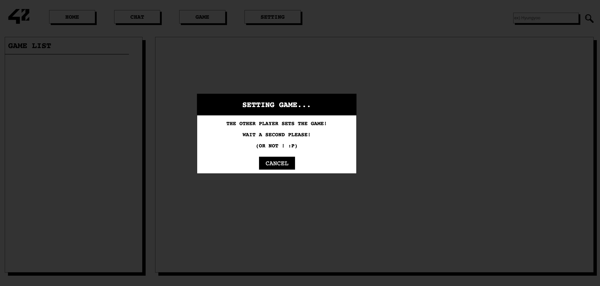

##### On gaming 01 (with big ball size setting)
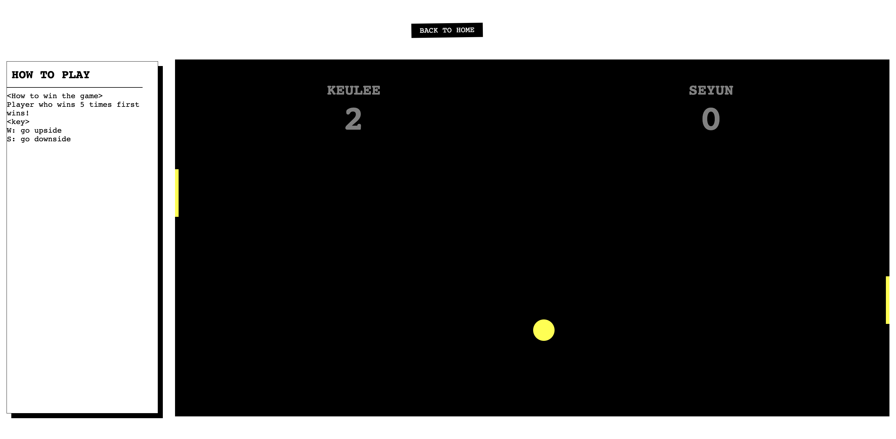

##### On gaming 02 (with small ball size setting)
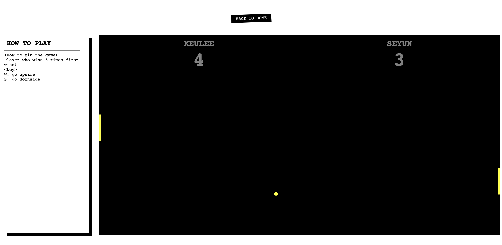

##### Game finished
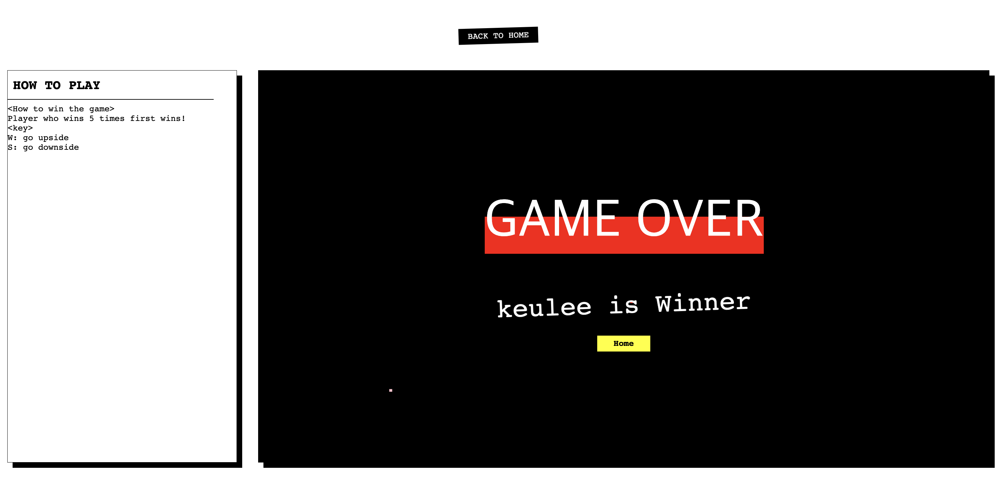

##### Setting Page
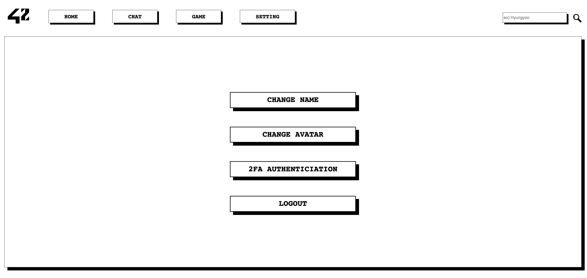

##### Change name
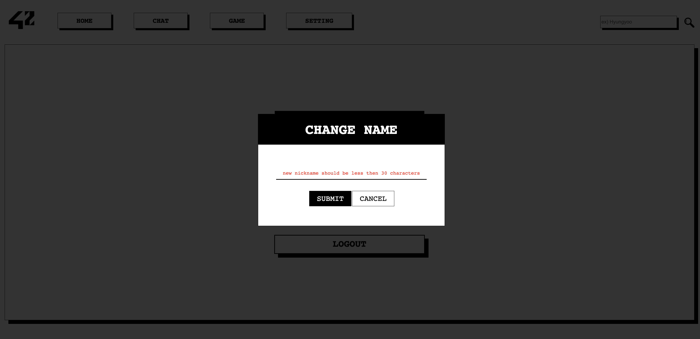

##### Change avatar
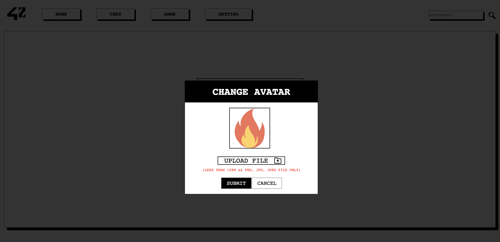

##### 2FA
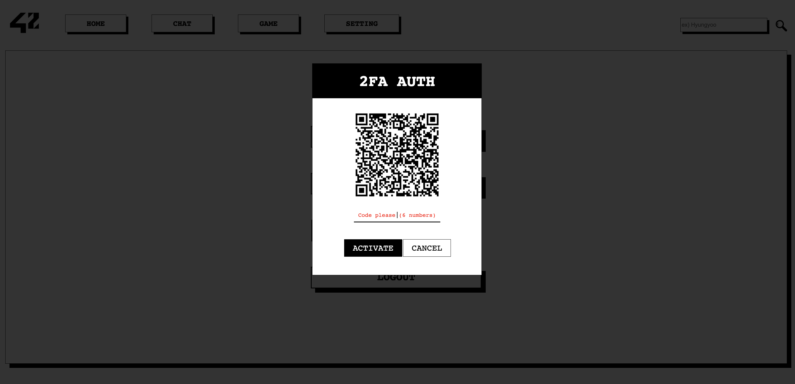

##  Made by

     
   
     
    
     
   
     
   
     
   

